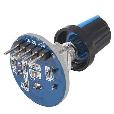
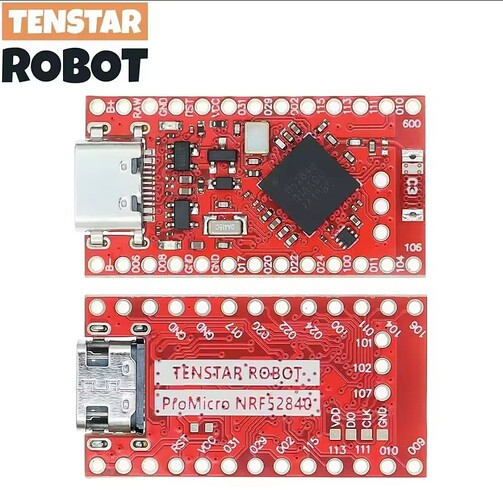

# 🔊 Bluetooth Audio Knob (nRF52840)


---

> 💡 **Note:** This project is far from perfect and there is a lot of room for improvement.
> The goal is not to be a polished product — but to **inspire someone** to build something similar or take it further.

> 🤖 **AI-assisted project:** The code was written using [claude.ai](https://claude.ai), [chatgpt.com](https://chatgpt.com) and [gemini.google.com](https://gemini.google.com) (vibe coding).
> This README and the project description were also generated with their help.

---

## 📸 Preview


| | |
|---|---|
|  |  |

---

## 🧠 Description

A wireless rotary encoder knob that connects via Bluetooth to a computer or Android device and controls audio.

- Rotate → Volume Up / Down
- Press → Mute + Play/Pause

Uses standard BLE HID commands — **no additional software required**.

> ⚠️ On Windows, there is occasional instability when the battery is low. The device may need to be removed and re-paired.

---

## 🚀 Features

- 🔊 **BLE HID media controller** — works as a Bluetooth keyboard (media keys)
- ⚡ **Low power design** — battery lasts **7–10 days**
- 🔄 **Interrupt-based encoder reading** — smooth and responsive
- 🖥️ **Compatible with Windows & Android** — no drivers required
- 🖨️ **3D printable enclosure** included

---

## 🎮 Controls

| Action | Function |
|--------|----------|
| Rotate clockwise | Volume up |
| Rotate counter-clockwise | Volume down |
| Press (short) | Mute |
| Press (long) | Play / Pause |

---

## ⚡ Power Optimization

The project was initially built using an **ESP32 Ultra Mini**, but battery life was only ~24 hours.

After switching to **nRF52840**:

- Significantly lower power consumption
- Battery life: **~7–10 days** (depending on signal strength)

---

## 🔧 Hardware

| Component | Price |
|-----------|-------|
| EC11 Rotary Encoder | ~1.90 EUR |
| 103450 3.7V 2000mAh Battery | ~2.50 EUR |
| nRF52840 Pro Micro (Tenstar Robot) | ~6.81 EUR |
| DPDT Slide Switch 2P2T 125VAC (Toggle Switch 2 Position 6 Pins, 5mm handle) | ~1.70 EUR / 10 pcs |

### Photos

| Encoder | nRF52840 | Battery | Slide Switch |
|---------|----------|---------|--------------|
|  |  |  |  |

---

## 🔌 Electrical Diagram


---

## ⚠️ Pin Mapping Issue

The board is an Adafruit clone — pin mapping does **not** match standard documentation.

Discovered mapping:

```cpp
TEST_PIN 12  ->  0.08
         11  ->  0.06
          7  ->  1.02
          3  ->  1.15  (D18)
          2  ->  0.10  (D16)
          1  ->  0.24  (D5)
```

---

## 💾 Firmware Upload (UF2)

> 💾 **Recovery tip:** A pre-built `firmware.uf2` is included in this repo.
> If the board gets into a broken state after experiments or failed flashes and you can no longer upload via USB-to-Serial,
> use boot mode (double-tap reset) to mount it as a USB drive and drag & drop the included `firmware.uf2` to restore it.

### 1. Convert HEX → UF2

Using PlatformIO's bundled tool:

```bash
python "$env:USERPROFILE\.platformio\packages\framework-arduinoadafruitnrf52\tools\uf2conv\uf2conv.py" \
  -c -f 0xada52840 -o firmware.uf2 firmware.hex
```

Or if `uf2conv.py` is in your PATH:

```bash
uf2conv.py -c -f 0xada52840 -o firmware.uf2 firmware.hex
```

### 2. Enter Boot Mode

1. **Double-tap** the reset button (RST → GND rapidly)
2. The device will appear as a **USB mass storage drive**
3. **Drag & drop** `firmware.uf2` onto the drive
4. The device reboots automatically ✅

---

## 🖨️ 3D Models

STL files are included in the `/stl` directory:

| File | Description | Download |
|------|-------------|----------|
| `knob blutooth1.stl` | Enclosure part 1 | [⬇ Download](stl/knob%20blutooth1.stl) |
| `knob blutooth2.stl` | Enclosure part 2 | [⬇ Download](stl/knob%20blutooth2.stl) |
| `knob blutooth3.stl` | Knob cap | [⬇ Download](stl/knob%20blutooth3.stl) |
| `volume knob project.f3d` | Full Fusion 360 source project | [⬇ Download](stl/volume%20knob%20project.f3d) |

> 🖊️ The `.f3d` file contains the **complete Fusion 360 project** with all bodies, sketches and parameters.
> Feel free to open it, modify the dimensions, adapt it to different components, or redesign it entirely to suit your needs.

---

## 🛠️ Build & Development

This project uses **PlatformIO** with the Adafruit nRF52 framework.

```ini
; platformio.ini example
[env:nrf52840]
platform = nordicnrf52
board = adafruit_feather_nrf52840
framework = arduino
```

---

## 📝 Source Code

Full source — `src/main.cpp`:

```cpp
#include <Arduino.h>
#include <bluefruit.h>

// ── Pin definitions (clone board — pins differ from standard Adafruit docs) ──
#define ENCODER_CLK 11  // GPIO 0.06
#define ENCODER_DT  12  // GPIO 0.08
#define ENCODER_SW   1  // GPIO 0.24
#define LED_PIN     15

// Minimum ms between button presses to avoid bouncing
#define SW_DEBOUNCE_MS 350

// ── BLE service objects ──
BLEDis         bledis;   // Device Information Service (manufacturer, model)
BLEHidAdafruit blehid;   // HID service — sends media keys to the host
BLEBas         blebas;   // Battery Level Service

// ── Encoder state (volatile — modified inside interrupt) ──
volatile int encoderDelta = 0;  // Accumulated rotation steps (+/-)
volatile int lastClkState;      // Last known CLK pin state
bool isMuted = false;           // Tracks mute/unmute toggle state

volatile uint32_t lastSwPress = 0;  // Timestamp of last button press (debounce)

// ── Interrupt handler — called on every CLK edge ──
// Compares CLK and DT to determine rotation direction
void readEncoder()
{
    int clkState = digitalRead(ENCODER_CLK);
    if (clkState != lastClkState)
    {
        if (digitalRead(ENCODER_DT) != clkState)
            encoderDelta++;   // Clockwise → volume up
        else
            encoderDelta--;   // Counter-clockwise → volume down

        lastClkState = clkState;
    }
}

// ── Setup — runs once on power-on / reset ──
void setup()
{
    delay(2000);  // Give USB/serial time to initialize

    // LED off by default
    pinMode(LED_PIN, OUTPUT);
    digitalWrite(LED_PIN, LOW);

    // Configure encoder pins
    pinMode(ENCODER_CLK, INPUT);
    pinMode(ENCODER_DT,  INPUT);
    pinMode(ENCODER_SW,  INPUT_PULLUP);  // Button: LOW = pressed

    // Capture initial CLK state and attach interrupt
    lastClkState = digitalRead(ENCODER_CLK);
    attachInterrupt(digitalPinToInterrupt(ENCODER_CLK), readEncoder, CHANGE);

    // ── BLE initialization ──
    Bluefruit.begin();
    Bluefruit.setTxPower(6);               // TX power in dBm (range: -40 … +8)
    Bluefruit.setName("nRF52-Volume-LowPower");

    // Connection interval: 100–200 ms (balances latency vs. power consumption)
    Bluefruit.Periph.setConnInterval(80, 160);

    // Device info (appears in OS Bluetooth device list)
    bledis.setManufacturer("Logitech");
    bledis.setModel("nRF52-HID");
    bledis.begin();

    // Battery service — reports 100% (static, no actual measurement)
    blebas.begin();
    blebas.write(100);

    // HID service — handles all media key presses
    blehid.begin();

    // ── BLE advertising setup ──
    Bluefruit.Advertising.addFlags(BLE_GAP_ADV_FLAGS_LE_ONLY_GENERAL_DISC_MODE);
    Bluefruit.Advertising.addAppearance(0x03C1);  // HID Keyboard appearance
    Bluefruit.Advertising.addService(blehid);
    Bluefruit.Advertising.addService(blebas);
    Bluefruit.ScanResponse.addName();

    Bluefruit.Advertising.restartOnDisconnect(true);   // Auto re-advertise on disconnect
    Bluefruit.Advertising.setInterval(2048, 2048);      // Slow advertising = lower power
    Bluefruit.Advertising.start(0);                     // Advertise indefinitely
}

// ── Main loop — runs repeatedly ──
void loop()
{
    // Sleep until event if not connected (saves power)
    if (!Bluefruit.connected())
    {
        sd_app_evt_wait();
        return;
    }

    // ── Button handler — Mute + Play/Pause toggle ──
    if (digitalRead(ENCODER_SW) == LOW)
    {
        uint32_t now = millis();
        if ((now - lastSwPress) > SW_DEBOUNCE_MS)
        {
            lastSwPress = now;

            // Both mute and unmute send the same two keys — toggle tracked in isMuted
            blehid.consumerKeyPress(HID_USAGE_CONSUMER_MUTE);
            delay(10);
            blehid.consumerKeyRelease();
            delay(10);
            blehid.consumerKeyPress(HID_USAGE_CONSUMER_PLAY_PAUSE);
            delay(10);
            blehid.consumerKeyRelease();

            isMuted = !isMuted;
        }
    }

    // ── Encoder handler — Volume Up / Down ──
    if (abs(encoderDelta) >= 1)
    {
        // Safely read and reset delta outside interrupt context
        noInterrupts();
        int delta = encoderDelta;
        encoderDelta = 0;
        interrupts();

        uint16_t key = (delta > 0)
            ? HID_USAGE_CONSUMER_VOLUME_INCREMENT
            : HID_USAGE_CONSUMER_VOLUME_DECREMENT;

        blehid.consumerKeyPress(key);
        delay(5);
        blehid.consumerKeyRelease();
    }

    // Sleep until next BLE event (SoftDevice low-power wait)
    sd_app_evt_wait();
}
```

---

## 📚 Resources

- [nRF52840 Pro Micro / Nice!Nano — PlatformIO Overview](https://cool-web.de/nrf/nrf52840-promicro-nicenano-board-platformio-vorstellung.htm)
- [Using Pro Micro nRF52840 with Arduino IDE — Arduino Forum](https://forum.arduino.cc/t/using-the-pro-micro-nrf52840-board-with-the-arduino-ide/1347460)

---

## 📄 License

MIT — feel free to use, modify, and share.
